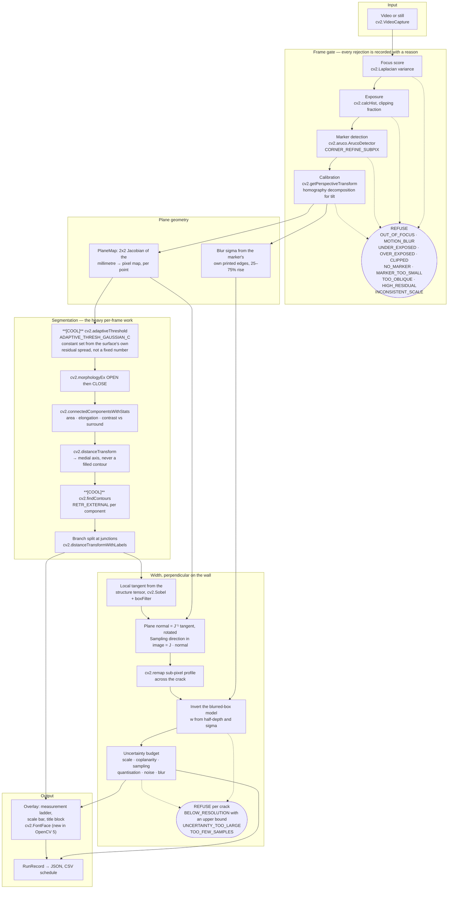
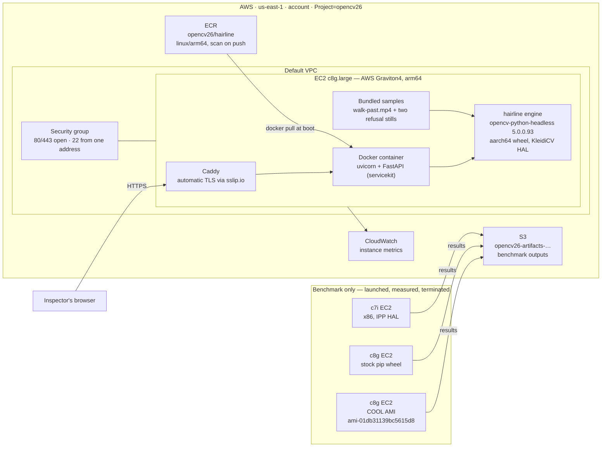
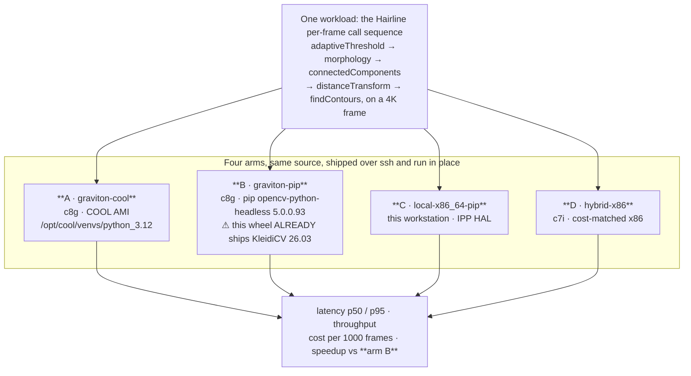

# Architecture

Three diagrams: what happens to a frame, what runs on AWS, and where the Cloud
Optimized OpenCV Library sits in that.

---

## 1. The measurement pipeline

Every box is OpenCV 5 unless it says otherwise. The two stages marked **[COOL]** are
the ones the Cloud Optimized OpenCV Library names in its own listing, and they are
where the per-frame time goes.



The two things in that diagram that are easy to get wrong, and that the evaluation
exists to check:

- **`DT` never runs on a filled contour.** Filling an open crack path and taking the
  maximum of the distance transform measures the area the path encloses, not the
  stroke. `research/FINDINGS.md` §5.0 recorded that reading 283 mm for a 0.75 mm
  crack. `tests/test_width_math.py` keeps that bug executable and asserts the engine
  contains no filled-contour call.
- **`N` uses the Jacobian, not a single scale.** Perpendicular-on-screen and
  perpendicular-on-the-wall are different directions as soon as the camera is not
  square on, and one pixel is a different number of millimetres in each.

---

## 2. AWS



**Why EC2 and not App Runner.** Every other product in this workshop deploys to App
Runner, which is simpler and cheaper. Hairline does not, for one reason: the Cloud
Optimized OpenCV Library is delivered as an Amazon Machine Image, so it runs on EC2
and on nothing else, and only on the `c8g`, `m8g` and `r8g` families. An entry
claiming COOL has to be an EC2 architecture. The demo endpoint therefore runs on the
same instance family the benchmark runs on, so the version banner a judge sees is
the architecture the benchmark describes.

**No load balancer.** An idle Application Load Balancer is about $16 a month for
nothing. Caddy on the instance terminates TLS with a certificate from Let's Encrypt,
using an `sslip.io` name that resolves to the instance's own address, so there is no
domain to buy and no balancer to pay for.

---

## 3. Where COOL sits, and what it is being compared against



Arm B exists because of the one thing that sinks most COOL submissions. The stock
PyPI **aarch64** wheel already bundles Arm's KleidiCV 26.03, confirmed by `strings`
on `cv2.abi3.so`:

```
Custom HAL:   YES (carotene (ver 0.0.1) KleidiCV (ver 26.03))
3rdparty:     ... tegra_hal kleidicv_hal kleidicv kleidicv_thread
```

So `pip install opencv-python` on Graviton is **not** an unaccelerated baseline.
Benchmarking COOL-on-Graviton against pip-on-x86 measures the processor, not the
library. Every speedup Hairline reports is computed against arm B, and
[`docs/cool-benchmark.md`](docs/cool-benchmark.md) states this in the results table
itself rather than in a footnote.
