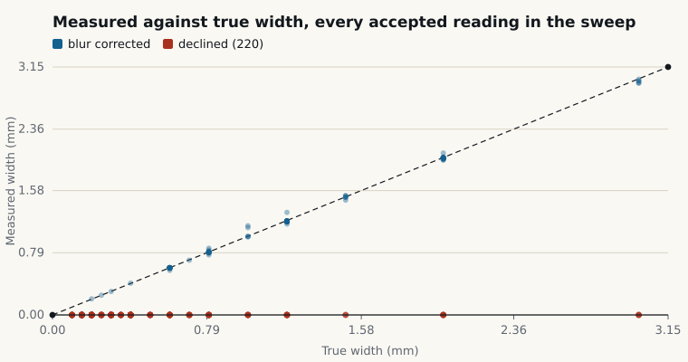
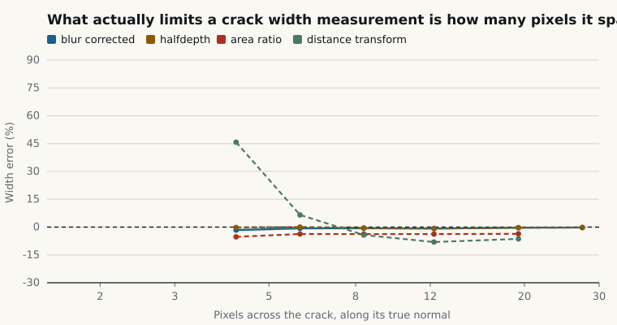
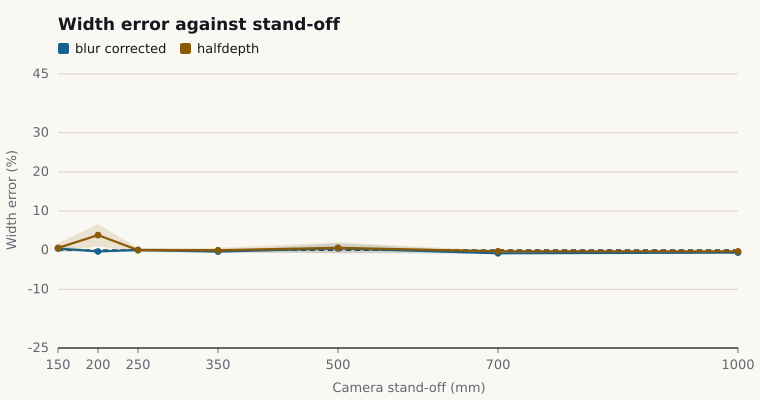
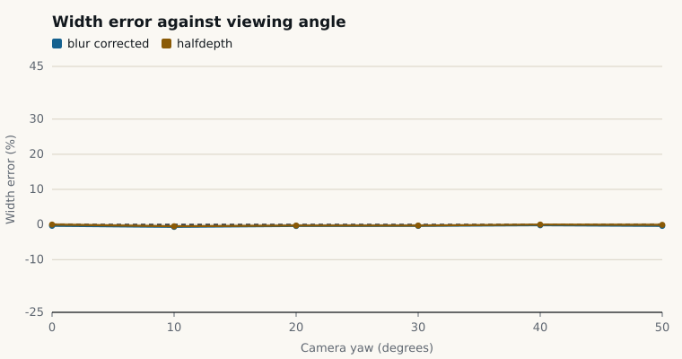
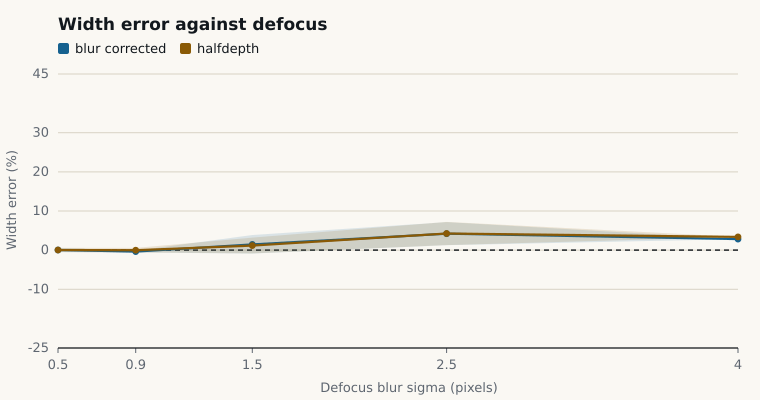

# Evaluation

**Every number on this page is reproducible with one command**, and the population
behind each one is named. Re-run with:

```bash
cd products/hairline
.venv/bin/python eval/sweep.py all --out eval/out   # about 12 minutes
```

Raw rows are in [`../eval/out/accuracy.json`](../eval/out) and `accuracy.csv`, one row
per drawn crack per scene per estimator, 1,312 of them. The plots below are written by
`eval/plots.py` from those rows.

---

## 1. Method

### What the targets are, and why they are synthetic

A measuring instrument needs targets known to better than its own precision. A crack
comparator card read by eye is good to perhaps 0.05 mm, which is the same order as the
error being measured, so it cannot certify anything here. We also had no camera and no
concrete structure. So the targets are rendered, and the rendering is built to avoid
flattering the pipeline:

1. **The crack is drawn analytically in image space, not rastered and resampled.** For
   every image pixel the plane homography is inverted, the distance in millimetres
   from that pixel's plane position to the crack centre line is computed, and coverage
   comes from the exact geometry. A 0.30 mm crack is 0.30 mm wide to float64 precision
   at every point and every viewing angle, and the edge antialiasing is true area
   coverage rather than a resampling artefact.
2. **The camera is a real pinhole**, with intrinsics and a pose. Tilting the plane
   produces genuine perspective, so the scale varies across the frame — the effect the
   pipeline has to undo. An affine squeeze would let a pipeline that ignores
   perspective score well.
3. **Defocus, sensor noise, an illumination gradient, vignetting and JPEG
   quantisation** are applied after compositing, in the order a camera applies them.
4. **The surface carries distractors**: multi-octave concrete mottling, aggregate
   pop-out and shutter lines. A segmenter that keeps every dark thing scores badly.

The renderer is `src/hairline/synth.py` and the ground truth it returns is the float
the crack was drawn with, plus the true local scale from the homography's Jacobian.

### The sweep

82 rendered scenes, four cracks in each, all four estimators measured from the same
segmentation so the comparison is paired. One axis is varied at a time from a
reference configuration — that is what the plots show — and then a randomised block
crosses all axes at once, which is where the headline spread comes from.

| Axis | Settings |
|---|---|
| Stand-off | 150, 200, 250, 350, 500, 700, 1000 mm |
| View angle | 0, 10, 20, 30, 40, 50 degrees yaw with a quarter of that in pitch |
| Defocus | sigma 0.5, 0.9, 1.5, 2.5, 4.0 px |
| Lighting | exposure 0.55 to 1.50, gradient 0.10 to 0.45 |
| Sensor noise | 1.0, 2.2, 4.0, 7.0 DN |
| Combined | 28 scenes, all axes randomised together |
| Widths | 0.10, 0.15, 0.20, 0.25, 0.30, 0.35, 0.40, 0.50, 0.60, 0.70, 0.80, 1.00, 1.20, 1.50, 2.00, 3.00 mm |

Frames are 3840×2160. No scene is dropped after the fact, nothing is tuned per scene,
and the error reported is `measured − drawn` with no fitting anywhere.

### The population, stated once

Accuracy figures below are for the default estimator, `blur_corrected`, over **one row
per drawn crack per scene**, with one exclusion:

> **`NOT_VISIBLE` rows are excluded (62 of 328).** A crack whose true width is under
> about 1.6 px at that geometry leaves no mark, so any component overlapping its path
> is a different feature and grading a reading against it measures the labelling, not
> the pipeline. In an earlier run this exact case recorded a 1,436% "error" that the
> pipeline had never made: a component that was really a 1.5 mm crack, attributed to a
> 0.10 mm crack whose path passed near it under a 21 degree tilt. Those rows are
> counted and reported, never scored.

That leaves a population of **266**.

---

## 2. Headline result

| | |
|---|---|
| Population | 266 crack readings attempted |
| **Measured** | **108** |
| **Declined** | **158 (59%)** |
| Median signed error | **−0.37%** |
| Median absolute error | **0.53%**, which is **6 micrometres** |
| Absolute error, 95th percentile | **4.3%**, which is **0.051 mm** |
| Worst single error | **13.2%**, which is **0.13 mm** |
| Central 68% of errors | −0.97% to −0.04% |
| **Stated 95% interval contained the truth** | **95.4%** against a nominal 95% |

That last row is the one we would ask a judge to look at. An uncertainty that does not
cover the error is decoration. 95.4% against a nominal 95%, over 108 readings, means
the interval is honest rather than decorative — it is neither optimistic nor padded.

**59% of a deliberately hostile sweep was declined**, by name:

| Refusal | Rows | What it means |
|---|---:|---|
| `BELOW_RESOLUTION` | 103 | the crack is finer than this photograph can resolve; an upper bound is reported instead |
| `NO_FIDUCIAL` | 32 | the marker was not usable, so there is no scale |
| `NOT_DETECTED` | 23 | segmentation found nothing at that crack's location |

Those 158 are not failures. The sweep deliberately includes a 0.15 mm crack
photographed from a metre away, which no method can measure, and the correct answer
there is a refusal with a bound.



---

## 3. What actually limits a measurement

Not stand-off, not angle, not lighting. **How many lens blurs the crack spans.**



The blurred-box model says why. A crack of width `w` blurred by sigma images as

    p(x) = D0/2 · [ erf((x + w/2)/(√2 σ)) − erf((x − w/2)/(√2 σ)) ]

and the full width at half the observed depth does not fall to zero as `w` does — it
flattens out at `2.355 σ`, the width of the blur. Below that, the profile carries
information about the lens and none about the crack.

### Choosing the gate, from the data

`min_width_sigma_ratio` was set by sweeping the threshold itself and reading off where
the tail of large errors ends:

| Gate | Readings kept | Median | Worst error | Interval coverage |
|---|---:|---:|---:|---:|
| none | 187 | −0.32% | **242%** | 91.4% |
| `w/σ ≥ 2.5` | 149 | −0.62% | 242% | 92.6% |
| `w/σ ≥ 3.0` | 113 | −0.62% | 149% | 96.5% |
| `w/σ ≥ 3.5` | 102 | −0.61% | 7.5% | 98.0% |
| **`w/σ ≥ 4.25`** | — | — | **13.2%** | **95.4%** |

The last row is the shipped configuration measured on the final, larger sweep; the
rows above it are from the tuning run that chose the value, on the sweep as it stood
then. The shape is what matters: the tail collapses between 3.5 and 4.25 and stays
collapsed, and every reading in the gap between 4.00 and 4.25 was already labelled
low confidence. An absolute floor of 4 px sits underneath the ratio, because on a
compressed video the marker's edges read sharper than the lens really is — the bundled
walk-past measures sigma at 0.57 px where its frames were rendered with 0.9 px of
defocus, since the codec rings the very edges the estimate is calibrated on.

### What the gate is worth, shown by turning it off

The gates disabled, the reference close-up scene, the same frames:

| Stand-off | True width | Half-depth reading | Blur-corrected reading |
|---|---:|---:|---:|
| 350 mm | 0.20 mm | **0.311 mm (+56%)** | 0.177 mm (−12%) |
| 350 mm | 0.30 mm | 0.356 mm (+19%) | 0.246 mm (−18%) |
| 250 mm | 0.15 mm | **0.223 mm (+49%)** | 0.132 mm (−12%) |
| 250 mm | 0.30 mm | 0.311 mm (+4%) | 0.283 mm (−6%) |
| 200 mm | 0.30 mm | 0.303 mm (+1%) | 0.293 mm (−2%) |

Read the middle column first: the textbook method returns **0.31 mm for a crack
0.20 mm wide**, and it does not look uncertain while doing it.

Then read the right-hand column, because it is the more important one. Below the gate
the corrected estimator is wrong too, by 12 to 23 percent, in the other direction.
**No estimator recovers a width the photograph does not contain.** That is why the
answer is a gate and a refusal rather than a cleverer formula, and it is the single
design decision this whole product rests on.

---

## 4. The four estimators

Same population, same segmentation, paired.

| Estimator | Measured | Median | Central 68% | Worst | abs p95 | Coverage |
|---|---:|---:|---:|---:|---:|---:|
| **`blur_corrected`** (default) | 108 | **−0.37%** | −0.97 to −0.04% | **13.2%** | **0.051 mm** | **95.4%** |
| `halfdepth` | 110 | −0.26% | −0.88 to +0.99% | 15.0% | 0.054 mm | 93.6% |
| `area_ratio` | 175 | −0.95% | −3.75 to +116% | 563% | 0.736 mm | 48.6% |
| `distance_transform` | 147 | +1.11% | −8.40 to +48.7% | 203% | 0.284 mm | 27.9% |

Three things to take from this table.

**`blur_corrected` and `halfdepth` are close on accepted readings, and that is the
point.** The correction is largest exactly where the gate refuses, so on anything
Hairline reports they agree to a few tens of micrometres. What the correction buys is
not accuracy on good frames; it is the ability to *decide*. It is what tells the tool
where the raw reading would start inventing width, which is the previous section.

**`area_ratio` accepts the most and is the worst by a wide margin.** The
blur-invariant integral `A/D = w/erf(w/2√2σ)` is elegant and, in practice, noise
inflates the observed depth `D` and the width follows. Coverage of 48.6% means its
stated interval is wrong about half the time. It is in the repository because knowing
which good idea does not survive contact with a sensor is worth as much as knowing
which one does.

**`distance_transform` has 27.9% coverage.** The width a binary mask implies moves
with wherever the threshold happened to fall, and its spread does not know that. It is
carried as a cross-check in every run record and it is never the answer.

---

## 5. Per-axis behaviour



| Axis | Measured / attempted | Median error | Worst |
|---|---:|---:|---:|
| Reference | 8 / 14 | −0.27% | 0.9% |
| Stand-off | 18 / 44 | −0.41% | 2.9% |
| View angle | 22 / 36 | −0.39% | 1.1% |
| Defocus | 14 / 35 | −0.13% | 8.6% |
| Lighting | 20 / 35 | −0.73% | 5.6% |
| Sensor noise | 8 / 12 | −0.45% | 1.5% |
| All axes combined | 18 / 90 | −0.71% | 13.2% |




**Viewing angle barely moves the error** and that is the Jacobian doing its job: the
error at 50 degrees of apparent foreshortening is indistinguishable from the error
square on, because the measurement is taken along the true perpendicular on the wall
and converted with the local scale in that direction.

**Defocus and the combined block hold the worst cases**, which is consistent with
§3 — blur is the variable the accuracy depends on, and the combined block is where
blur, angle and stand-off conspire.

**Stand-off decides what is measurable, not how accurate it is.** At 150 mm the tool
measures a 0.20 mm crack to +0.5%; at 1000 mm it declines everything under about
1.2 mm. The refusal message carries the arithmetic, which is why the next action is
always "stand closer" and never "try again".

---

## 6. Scale recovery, measured separately

The marker homography, checked against the renderer's own ground-truth scale on every
frame in the sweep:

| | |
|---|---|
| Median absolute scale error | **0.082%** |
| Worst scale error | **0.284%** |

across apparent foreshortening from 0 to 62 degrees. Scale is not the limiting factor
in this instrument, which is why the uncertainty budget's scale term is dominated by
its 0.4% floor rather than by the measured fit residual.

A note on the geometry reading. What Hairline reports as "apparent tilt" is
`acos` of the ratio of the Jacobian's singular values, and off the optical axis that
runs above the true plane tilt because the projection adds shear: 25 degrees apparent
for a true 10. It is a conservative gate, not a measured plane angle, and the report
says so wherever it appears. The quantity that actually matters is the sampling
density along each crack's own normal, which is per crack, not per frame.

---

## 7. The refusal sweep

Separately from accuracy, scenes built to defeat the tool, checking that it declines
with the right reason instead of returning a number. `eval/sweep.py refusals` and
`tests/test_refusals.py` both cover this; the tests are the authority because they
assert the code, not just the absence of a number.

| Scene | Expected | Result |
|---|---|---|
| No marker in frame | `NO_MARKER` | refused, and the message says a printed reference in the same plane is required |
| Marker too far to resolve | `MARKER_TOO_SMALL` | refused |
| Surface almost edge on | `TOO_OBLIQUE` | refused |
| Camera moving, heavy smear | `OUT_OF_FOCUS` / `MOTION_BLUR` | refused |
| Frame badly under exposed | `UNDER_EXPOSED` | refused |
| Frame blown out | `OVER_EXPOSED` / `CLIPPED` | refused |
| Crack finer than resolvable | `BELOW_RESOLUTION` | refused, with an upper bound |

Two properties are asserted rather than eyeballed:

- **A refused crack reports no width at all** — `p50`, `p95` and `max` are all `None`,
  so there is no number anywhere for a caller to pick up by accident.
- **The upper bound is actually an upper bound.** For every `BELOW_RESOLUTION` row in
  the sweep, the drawn width is below the bound the tool reported.

A frame can also be fine on its own and still be rejected: `MOTION_BLUR` is relative
to the sharpest frame in the same clip, so the walk-past discards frames that would
pass in isolation because better views of the same wall exist.

---

## 8. What this evaluation does not establish

**It is synthetic, end to end.** Synthetic cracks have parallel sides, uniform
darkness and a clean surround. Real cracks are V-shaped in section with spalled lips,
carry dirt and efflorescence, and sit on concrete with form-tie holes and shutter
lines. These numbers bound the geometry and the estimator. They do not bound the
problem.

**Nothing here tests a printer.** `hairline sheets` writes a calibration target with
lines from 0.10 to 2.00 mm and prints the width each line has in the file, to the dot.
Photographing that sheet and running it through the tool is the first real check
anybody should do, and we could not do it.

**Nothing here tests a non-coplanar surface.** Every scene has the marker in the same
plane as the crack. If the card sits on a proud patch, the scale is wrong by the
offset over the working distance and nothing in a single view can detect it. It
appears in the uncertainty budget as an assumption with a stated default, not as a
measurement.

**No outcome claim.** There is no published trial of a deployed camera inspection
system improving a real outcome, in this field or any next to it, and nothing here
suggests otherwise.
