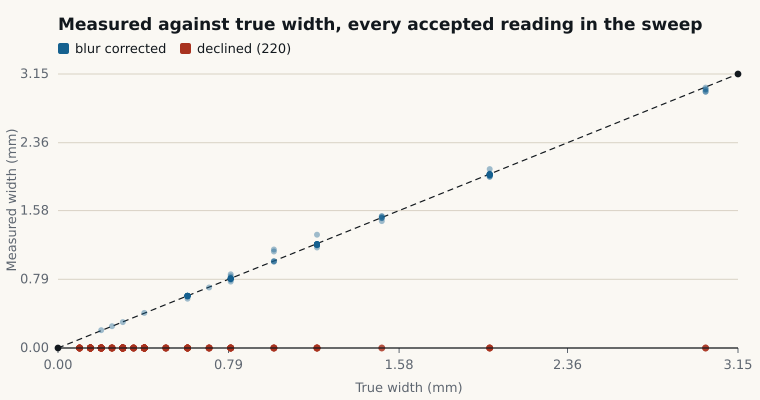
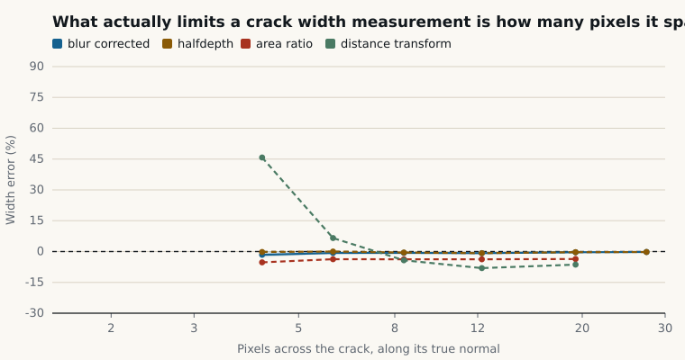
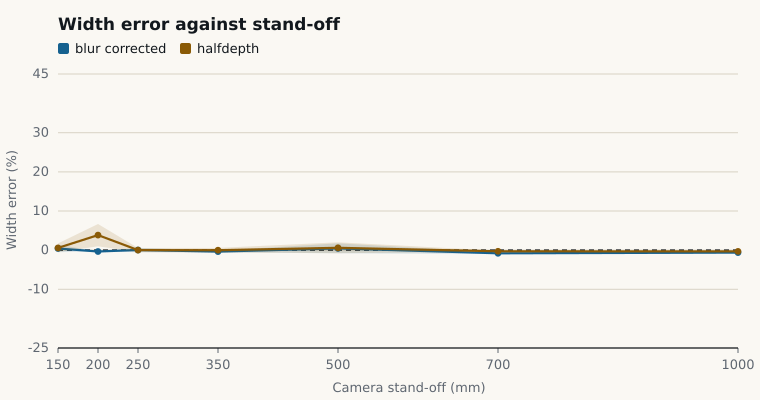
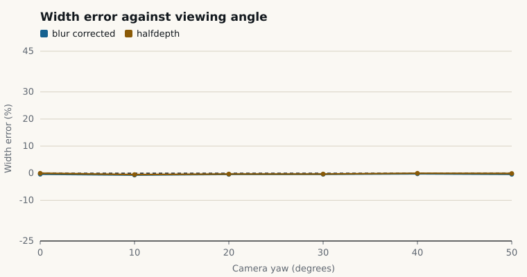
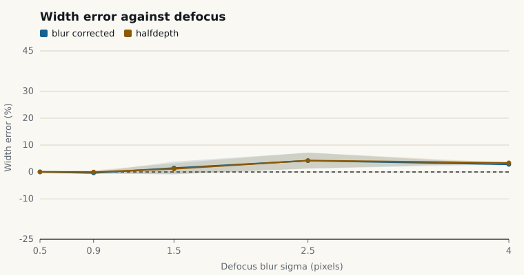

# Evaluation

Every number on this page is reproducible with one command, and the population behind
each one is named:

```bash
cd products/hairline
.venv/bin/python eval/sweep.py all --out eval/out   # about 12 minutes
```

Raw rows are in [`../eval/out/accuracy.json`](../eval/out) and `accuracy.csv`, one row
per drawn crack per scene per estimator, 1,312 of them. The plots below are written by
`eval/plots.py` from those rows.

---

## 1. Method

### What the targets are, and why they are synthetic

A measuring instrument needs targets known to better than its own precision. A crack
comparator card read by eye is good to perhaps 0.05 mm, the same order as the error
being measured, and we had no camera and no concrete structure. So the targets are
rendered, and the rendering is built not to flatter the pipeline:

1. **The crack is drawn analytically in image space, not rastered and resampled.** For
   every pixel the plane homography is inverted and the distance in millimetres to the
   crack centre line is computed, so a 0.30 mm crack is 0.30 mm wide to float64
   precision at every point and angle, with true area-coverage antialiasing.
2. **The camera is a real pinhole**, with intrinsics and a pose, so tilting the plane
   gives genuine perspective and the scale varies across the frame. An affine squeeze
   would let a pipeline that ignores perspective score well.
3. **Defocus, sensor noise, an illumination gradient, vignetting and JPEG
   quantisation** are applied after compositing, in camera order.
4. **The surface carries distractors**: multi-octave concrete mottling, aggregate
   pop-out and shutter lines.

The renderer is `src/hairline/synth.py`. The ground truth it returns is the float the
crack was drawn with, plus the true local scale from the homography's Jacobian.

### The sweep

82 rendered scenes, four cracks in each, all four estimators measured from the same
segmentation so the comparison is paired. One axis is varied at a time from a reference
configuration, then a randomised block crosses all axes at once.

| Axis | Settings |
|---|---|
| Stand-off | 150, 200, 250, 350, 500, 700, 1000 mm |
| View angle | 0, 10, 20, 30, 40, 50 degrees yaw with a quarter of that in pitch |
| Defocus | sigma 0.5, 0.9, 1.5, 2.5, 4.0 px |
| Lighting | exposure 0.55 to 1.50, gradient 0.10 to 0.45 |
| Sensor noise | 1.0, 2.2, 4.0, 7.0 DN |
| Combined | 28 scenes, all axes randomised together |
| Widths | 0.10, 0.15, 0.20, 0.25, 0.30, 0.35, 0.40, 0.50, 0.60, 0.70, 0.80, 1.00, 1.20, 1.50, 2.00, 3.00 mm |

Frames are 3840×2160. No scene is dropped after the fact, nothing is tuned per scene,
and the error reported is `measured − drawn` with no fitting anywhere.

### The population, stated once

Accuracy figures below are for the default estimator, `blur_corrected`, over **one row
per drawn crack per scene**, with one exclusion:

> **`NOT_VISIBLE` rows are excluded (62 of 328).** A crack whose true width is under
> about 1.6 px at that geometry leaves no mark, so any component overlapping its path
> is a different feature and grading a reading against it measures the labelling, not
> the pipeline. In an earlier run this exact case recorded a 1,436% "error" that the
> pipeline had never made: a component that was really a 1.5 mm crack, attributed to a
> 0.10 mm crack whose path passed near it under a 21 degree tilt. Those rows are
> counted and reported, never scored.

That leaves a population of **266**.

---

## 2. Headline result

| | |
|---|---|
| Population | 266 crack readings attempted |
| **Measured** | **103** |
| **Declined** | **163 (61%)** |
| Median signed error | **−0.61%** |
| Median absolute error | **0.61%**, which is **6 micrometres** |
| Absolute error, 95th percentile | **2.1%**, which is **0.036 mm** |
| Worst single error | **5.6%**, which is **0.056 mm** |
| Central 68% of errors | −1.02% to −0.19% |
| **Stated 95% interval contained the truth** | **98.1%** against a nominal 95% |

An uncertainty that does not cover the error is decoration. 98.1% against a nominal
95%, over 103 readings, means the interval is slightly conservative, which is the
direction an instrument should err in.

**61% of a deliberately hostile sweep was declined**, by name:

| Refusal | Rows | What it means |
|---|---:|---|
| `BELOW_RESOLUTION` | 108 | the crack is finer than this photograph can resolve; an upper bound is reported instead |
| `NO_FIDUCIAL` | 32 | the marker was not usable, so there is no scale |
| `NOT_DETECTED` | 23 | segmentation found nothing at that crack's location |

Those 163 are not failures. The sweep deliberately includes a 0.15 mm crack
photographed from a metre away, which no method can measure; the correct answer there
is a refusal with a bound.



---

## 3. What actually limits a measurement

Not stand-off, not angle, not lighting: **how many lens blurs the crack spans.**



A crack of width `w` blurred by sigma images as

    p(x) = D0/2 · [ erf((x + w/2)/(√2 σ)) − erf((x − w/2)/(√2 σ)) ]

and the full width at half the observed depth flattens out at `2.355 σ`, the width of
the blur, instead of falling to zero. Below that the profile carries information about
the lens and none about the crack.

### Choosing the gate, from the data

`min_width_sigma_ratio` was set by sweeping the threshold itself and reading off where
the tail of large errors ends:

| Gate | Readings kept | Median | Worst error | Interval coverage |
|---|---:|---:|---:|---:|
| none | 187 | −0.32% | **242%** | 91.4% |
| `w/σ ≥ 2.5` | 149 | −0.62% | 242% | 92.6% |
| `w/σ ≥ 3.0` | 113 | −0.62% | 149% | 96.5% |
| `w/σ ≥ 3.5` | 102 | −0.61% | 7.5% | 98.0% |
| **`w/σ ≥ 4.25`, shipped** | **103** | **−0.61%** | **5.6%** | **98.1%** |

The first four rows are the tuning run that chose the value; the last is the shipped
configuration on the final sweep. The tail collapses between 3.5 and 4.25.

**The gate is applied per crack, not per width sample.** Applied per sample, the floor
discards the samples that measured narrow and keeps the ones that measured wide, so a
crack just under the floor comes back *measured* from a biased subset: a 0.35 mm crack
read 0.382 mm, nine percent high, where it should have been refused. Resolvability is a
property of the crack and the frame, not of one noisy sample, so it is decided once, on
the median of every sample, and then every sample is kept or none are. That change moved
the sweep's worst error from 13.2% to 5.6% and its interval coverage from 95.4% to
98.1%.

An absolute floor of 4 px sits underneath the ratio, because on compressed video the
marker's edges read sharper than the lens really is: the bundled walk-past measures
sigma at 0.57 px where its frames were rendered with 0.9 px of defocus.

### What the gate is worth, shown by turning it off

The gates disabled, the reference close-up scene, the same frames:

| Stand-off | True width | Half-depth reading | Blur-corrected reading |
|---|---:|---:|---:|
| 350 mm | 0.20 mm | **0.311 mm (+56%)** | 0.177 mm (−12%) |
| 350 mm | 0.30 mm | 0.356 mm (+19%) | 0.246 mm (−18%) |
| 250 mm | 0.15 mm | **0.223 mm (+49%)** | 0.132 mm (−12%) |
| 250 mm | 0.30 mm | 0.311 mm (+4%) | 0.283 mm (−6%) |
| 200 mm | 0.30 mm | 0.303 mm (+1%) | 0.293 mm (−2%) |

The textbook half-depth method returns **0.31 mm for a crack 0.20 mm wide**, and it
does not look uncertain while doing it. Below the gate the corrected estimator is wrong
too, by 12 to 23 percent, in the other direction. **No estimator recovers a width the
photograph does not contain.** That is why the answer is a gate and a refusal rather
than a cleverer formula.

---

## 4. The four estimators

Same population, same segmentation, paired.

| Estimator | Measured | Median | Central 68% | Worst | abs p95 | Coverage |
|---|---:|---:|---:|---:|---:|---:|
| **`blur_corrected`** (default) | 103 | −0.61% | −1.02 to −0.19% | 5.6% | 0.036 mm | 98.1% |
| `halfdepth` | 103 | −0.31% | −0.88 to +0.43% | 4.5% | 0.032 mm | 98.1% |
| `area_ratio` | 98 | −3.60% | −4.95 to −3.17% | 10.1% | 0.109 mm | 81.6% |
| `distance_transform` | 110 | −4.53% | −8.57 to +3.52% | 79.1% | 0.235 mm | 36.4% |

**`halfdepth` is marginally the better of the top two on accepted readings** (median
−0.31% against −0.61%, worst 4.5% against 5.6%), and that does not make it the right
default. The gate that decided which readings are in this table is derived from the blur
model and has already removed every case where the raw half-depth reading fails. Inside
the fence the two agree to a few tens of micrometres; outside it, §3 shows half-depth
returning 0.311 mm for a 0.20 mm crack. The correction buys the fence, not accuracy on
good frames, and it carries the blur-calibration term in the uncertainty budget, which
is why both reach 98.1% coverage by different routes.

**`area_ratio` is biased 3.6% low with 81.6% coverage.** The blur-invariant integral
`A/D = w/erf(w/2√2σ)` fails in practice: sensor noise inflates the observed depth `D`
and the width follows it down.

**`distance_transform` has 36.4% coverage and a 79% worst case.** The width a binary
mask implies moves with the threshold, and its spread does not know that. It is carried
as a cross-check in every run record and is never the answer.

---

## 5. Per-axis behaviour



| Axis | Measured / attempted | Median error | Worst |
|---|---:|---:|---:|
| Reference | 8 / 14 | −0.39% | 0.9% |
| Stand-off | 18 / 44 | −0.56% | 2.0% |
| View angle | 22 / 36 | −0.43% | 1.1% |
| Defocus | 12 / 35 | −0.27% | 2.8% |
| Lighting | 20 / 35 | −0.87% | 5.6% |
| Sensor noise | 8 / 12 | −0.95% | 2.1% |
| All axes combined | 15 / 90 | −0.88% | 2.8% |




**Viewing angle barely moves the error**: the measurement is taken along the true
perpendicular on the wall and converted with the local scale in that direction.

**No axis holds a worst case above 5.6%**, and the one that reaches it is lighting, not
defocus: the 5.6% row is the brightest, most strongly graded scene in the sweep, where
the adaptive threshold's measured constant is working hardest.

**Stand-off decides what is measurable, not how accurate it is.** At 150 mm the tool
measures a 0.20 mm crack to +0.5%; at 1000 mm it declines everything under about
1.2 mm. The refusal message carries the arithmetic, so the next action is always
"stand closer" and never "try again".

---

## 6. Scale recovery, measured separately

The marker homography, checked against the renderer's own ground-truth scale on every
frame in the sweep:

| | |
|---|---|
| Median absolute scale error | **0.082%** |
| Worst scale error | **0.284%** |

across apparent foreshortening from 0 to 62 degrees. The uncertainty budget's scale term
is dominated by its 0.4% floor, not by the measured fit residual.

The "apparent tilt" Hairline reports is `acos` of the ratio of the Jacobian's singular
values. Off the optical axis it runs above the true plane tilt because the projection
adds shear (25 degrees apparent for a true 10), so it is a conservative gate, not a
measured plane angle. What matters is the sampling density along each crack's own
normal, which is per crack, not per frame.

---

## 7. The refusal sweep

Scenes built to defeat the tool, checking that it declines with the right reason
instead of returning a number. `eval/sweep.py refusals` and `tests/test_refusals.py`
both cover this; the tests are the authority because they assert the code.

**All eight scenes refuse, and each refuses with a code that names what was wrong.**

| Scene | Observed | Result |
|---|---|---|
| No marker in frame | `NO_MARKER` | refused; the message says a printed reference in the same plane is required |
| Marker 3.2 m away | `BELOW_RESOLUTION` | refused |
| Surface almost edge on | `TOO_OBLIQUE` | refused |
| Camera moving, heavy smear | `NO_MARKER` | refused |
| Frame badly under exposed | `UNDER_EXPOSED` | refused |
| Frame blown out | `OVER_EXPOSED` | refused |
| Crack finer than resolvable | `BELOW_RESOLUTION` | refused, with an upper bound |
| Surface texture, no measurable crack | `BELOW_RESOLUTION` | refused |

**"Marker 3.2 m away" gives `BELOW_RESOLUTION`, not `MARKER_TOO_SMALL`**: the 60 mm
marker still spans 56 pixels, above the 48-pixel floor, so the scale is recovered and it
is the *cracks* that cannot be measured. **"Camera moving, heavy smear" gives
`NO_MARKER` rather than `OUT_OF_FOCUS`**: at 14 pixels of blur the ArUco detector stops
finding the marker before the focus gate is reached. The test expectations name every
code that would be right.

Two properties are asserted rather than eyeballed:

- **A refused crack reports no width at all.** `p50`, `p95` and `max` are all `None`,
  so there is no number anywhere for a caller to pick up by accident.
- **The upper bound is actually an upper bound.** For every `BELOW_RESOLUTION` row in
  the sweep, the drawn width is below the bound the tool reported.

**`TOO_FAINT` refuses a wide component that is barely darker than the wall.** At a
900 mm stand-off on a wall whose cracks are all sub-pixel, two patches of surface
texture were reported as a 2.0 mm and a 1.5 mm crack. They were only 20 and 22 grey
levels darker than their surround, where the real cracks in the same sweep run 70 to
190. A crack is a shadowed void whose darkness does not fall off with distance, so a
measurable-width component that is barely darker than the wall is a stain, shadow or
texture. The threshold is absolute because at 900 mm the surface's own residual spread
collapses to 1.0 grey level, so those artefacts read as 20 sigma, the same as a crack.

A frame can also be fine on its own and still be rejected: `MOTION_BLUR` is relative
to the sharpest frame in the same clip, so the walk-past discards frames that would
pass in isolation because better views of the same wall exist.

---

## 8. What this evaluation does not establish

**Sections 1 to 7 are synthetic, end to end.** Synthetic cracks have parallel sides,
uniform darkness and a clean surround. Real cracks are V-shaped in section with spalled
lips, carry dirt and efflorescence, and sit on concrete with form-tie holes. These
numbers bound the geometry and the estimator, not the problem. §9 is the first contact
with real photographs.

**Nothing here tests a printer.** `hairline sheets` writes a calibration target with
lines from 0.10 to 2.00 mm and prints the width each line has in the file, to the dot.
Photographing that sheet and running it through the tool is the first real check, and
we could not do it.

**Nothing here tests a non-coplanar surface.** Every scene has the marker in the same
plane as the crack. If the card sits on a proud patch, the scale is wrong by the offset
over the working distance and nothing in a single view can detect it. It appears in the
uncertainty budget as an assumption with a stated default.

**The blur estimate reads low below about one pixel, and that matters on video.**
The 25-to-75 percent rise distance is measured by sampling the image along the
marker's edge normal with bilinear interpolation, and bilinear reconstruction of a
discrete edge is steeper than the continuous edge it came from. Measured on a frame
rendered with 0.9 px of defocus, the estimator returns 0.58 px raw, 0.55 px after JPEG
at quality 92, and 0.51 px after mp4v. The blur correction therefore under-corrects, so
widths near the resolution floor read slightly high rather than slightly low. On the
bundled walk-past, drawn widths of 1.60, 0.80 and 0.50 mm come back as 1.65, 0.83 and
0.53 mm, which is +3 to +6 percent, against under 1 percent for uncompressed stills of
the same wall.

Two things follow, and both are already in the build. The absolute floor of 4 pixels
exists for this: below a measured sigma of about 0.94 px it is the floor that binds,
not `4.25 x sigma`, so an under-read sigma cannot open the gate. And for readings that
matter, shoot stills or high-bitrate video rather than a compressed clip, because
compression does not blur the crack so much as sharpen the edge the correction is
calibrated on.

**No outcome claim.** There is no published trial of a deployed camera inspection
system improving a real outcome, in this field or any next to it, and nothing here
suggests otherwise.

---

## 9. Real photographs with a manual scale

Sections 1 to 7 are synthetic. This section is the first contact with real photographs,
and it is small: two test photos. It checks that the pipeline runs on a real surface and
says sensible things. It is not an accuracy figure: neither photo comes with a measured
ground-truth width, so no error or coverage number can be computed, and none is claimed.

### 9.1 Why marker-less photos need their own mode

The default pipeline needs Hairline's printed ArUco card in the frame and refuses
anything without one before crack detection starts. No public photo of a crack has that
card in it; every real image we ran through the CLI and the live service ended in
`NO_MARKER`, so a real crack never got measured.

Plenty of real inspection photos do carry a scale: a ruler, a crack-width gauge, a
tell-tale crack monitor. The manual scale mode (commit `1d2e307`) uses one of those. The
operator picks two points on the reference and enters the distance between them in
millimetres, as fractions of the frame's width and height so the same numbers work at any
resolution, and outlines the reference so its printed lines are not measured as cracks.

The same commit adds **black-hat segmentation** (`segmentation="blackhat"`). The
adaptive threshold was tuned on smooth synthetic concrete; on real pebbledash and
plaster its local mean follows the texture and the crack breaks into hundreds of
fragments, none surviving the length filter. A morphological black-hat with an element a
few crack widths across keeps only what is darker than its surroundings at that scale,
and hysteresis grows strong seeds along weaker continuations. The default is still
`adaptive`, so every synthetic number above stands.

### 9.2 Development and test split

Tuning used a development set of real photographs that carry **no scale at all**, so
nothing tuned on them could have been fitted to a width. It is detection only:
10 Wikimedia Commons photos and 6 patches from the Özgenel concrete crack dataset on
Mendeley, 16 images with 18 cracks or crack networks traced by eye
([`../eval/real_dev/README.md`](../eval/real_dev), labels in `labels.json`). A kept
component counts as a hit when at least 60% of its skeleton lies near a labelled line.
Anything else counts as false.

54 settings of the black-hat filters were swept (`results.json`). The best-scoring one
found 17 of 18 cracks with 2,013 false components, so it was not chosen. Before and
after the frozen setting:

| | Cracks found | False components | False per image |
|---|---:|---:|---:|
| Before, filters as of `1d2e307` | 1 / 18 | 0 | 0.0 |
| After, frozen | **12 / 18** | 231 | 14.4 |

191 of the 231 false components come from two 4000×3000 photos of clad walls, where the
panel joints are long, dark and straight, and no contrast or shape filter tells them
apart from a crack. On a surface like that the operator has to outline the joints as
exclusion regions. The misses were all three cracks on an exposed-aggregate slab, a 1936
archive print, a short stub on one photo and one Mendeley patch.

Two photos were held back as the test set. Both show a crack next to a reference of
known size. Neither was opened or run until the settings above were committed, and
nothing was retuned after they were run:

| Test photo | Reference in frame | Licence |
|---|---|---|
| `Crack_DSC07068.JPG`, IJD Dublin | Avongard crack card | Public domain |
| `Crack_monitor_in_Dnipro.jpg`, Alex Blokha | crack monitor | CC BY-SA 4.0 |

Run records are kept outside the repository, because the images are not ours to
redistribute: `media/real/hairline/scaled/runs/{dsc07068,dnipro}/run.json`.

### 9.3 The uncertainty model for a two-point scale

Two points give a scale and nothing else, where a printed marker also gives a
homography, a fit residual, a tilt and a measured blur. The budget charges for each
thing it cannot see.

**Click error.** Each point can be off by `manual_scale_click_px` from where the
operator meant it. At worst the two errors add along the line, so the span moves by up
to twice that:

    u_click = 2 × click_px / span_px

**Unmeasured tilt.** A two-point scale is isotropic and assumes the surface is square to
the camera. The operator states the largest tilt they will vouch for,
`manual_scale_max_tilt_deg` (default 10°). A surface that far off square foreshortens
by up to

    u_tilt = 1 / cos(tilt) − 1

which is 1.54% at 10°. The two terms are added rather than combined in quadrature,
because nothing in a single view can separate them:

    scale_rel = max(0.4%, u_click + u_tilt)

That scale term goes into the same budget as any other reading, next to coplanarity,
sampling, quantisation and estimator noise, and is reported at k = 2.

**Blur is a default.** With no marker there is no printed step edge to measure the lens
blur from. The pipeline uses sigma = 0.9 px with a standard uncertainty of 0.25 px and
says so in the caption of every overlay: "blur sigma 0.90 px from default (no marker)".
The resolution gate stays at max(4 px, 4.25 × sigma), and at the default that is the
4 px floor.

### 9.4 Results on the two test photos

| | DSC07068 (Avongard card) | Dnipro (crack monitor) |
|---|---|---|
| Reference length used | 80 mm on the card | 40 mm on the monitor |
| Span between the two points | 895.8 px | 510.0 px |
| Click error allowed | 3 px | 5 px |
| Scale | 11.197 px/mm | 12.75 px/mm |
| Scale uncertainty, click + 10° tilt | ±2.21% (0.67% + 1.54%) | ±3.50% (1.96% + 1.54%) |
| Finest measurable width at the 4 px floor | 0.357 mm | 0.314 mm |
| Operator's expected width | 0.3 mm | 4.0 mm |
| Components found on the crack | **6** | **0** |
| Measured | 3 | 0 |
| Refused | 3, all `BELOW_RESOLUTION`, narrower than 0.357 mm | none |

The three measured runs on DSC07068, from `run.json`, with widths in mm and the expanded
uncertainty (k = 2) on the 95th percentile:

| Run | Median | p95 ± U | Length | Samples | Pixels across | Confidence |
|---|---:|---:|---:|---:|---:|---|
| C001 | 0.386 | 0.485 ± 0.060 | 34.2 | 75 | 4.33 | low |
| C003 | 0.493 | 0.711 ± 0.079 | 10.2 | 30 | 5.52 | moderate |
| C004 | 0.462 | 0.519 ± 0.080 | 7.3 | 15 | 4.97 | low |

The annotated overlay (`000-station.jpg` next to each run record, not committed, like
the photos) shows the three measured runs and the three declined ones along the upper
half of the crack. The card, the two studs and the painted number were outlined as
exclusion regions.

**How to read those numbers.** None of this is an accuracy result: the comparator lines
printed on the Avongard card do not sit on the crack, so there is nothing to score
against. Read by eye against the crack, it looks like a hairline of roughly 0.2 to
0.3 mm, an eyeball reading of a gauge and not a measurement. The measured medians of
0.39 to 0.49 mm are on the high side of it. Every measured run sits within about 1.5 px
of the 4 px floor, where §8 shows widths read high when blur is under-estimated, and
here blur is not measured at all. Two of the three runs carry low confidence. The three
refusals are the most reliable part: those stretches are finer than this photo can
resolve, and the tool said so.

**Dnipro is a failure.** Segmentation kept nothing: across the frame, 16 components
were rejected on area and 2 as too short. The likely cause is the length filter:
black-hat mode requires 20 crack widths, and with the operator's expected width of
4.0 mm at 12.75 px/mm that is about 1,020 px, longer than the visible crack. We have not
confirmed that. The settings were frozen before the test, so it is reported as it ran,
not rerun with a smaller expected width.

### 9.5 Limitations of this mode

**Blur is assumed, not measured.** The blur correction and the resolution gate both run
off a default sigma. If the lens was softer than 0.9 px, narrow cracks read wide and the
gate lets through cracks it should refuse. The 0.25 px uncertainty on sigma widens the
interval near the floor, but it cannot fix a sigma that is simply wrong.

**Lengths are lower bounds when a crack leaves the frame.** Both test photos are close
crops. With `keep_edge_cracks`, a band along the frame edge is blanked before crack
finding, so each width profile is complete and the crack is measured on its interior
only; the length is the part inside the band, and the run record carries a warning.

**A hand-held card may not lie in the plane of the crack.** A crack card held up to a
wall, or a monitor screwed across a crack on a rough surface, can stand proud of the
surface or sit at an angle to it. The coplanarity term covers a stated offset (2 mm at
350 mm by default). It cannot detect a card that was actually tilted towards the
camera, and it has no way to tell that from a tilted wall. The tilt allowance is the
operator's promise, not a measurement.

**Two photos is not an evaluation.** One ran end to end and produced widths and
refusals. The other found nothing. Accuracy on real concrete still needs the check in
§8: print the calibration target, photograph it, and compare against the widths printed
on it.
